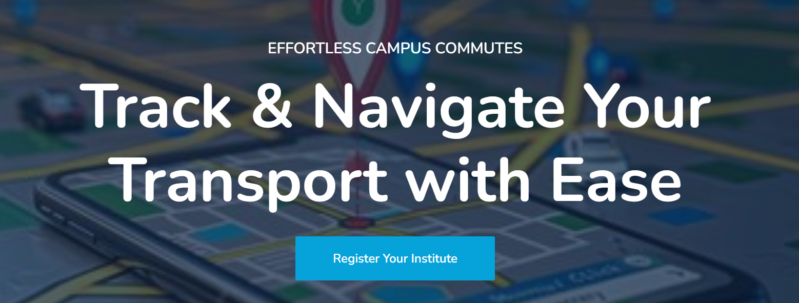
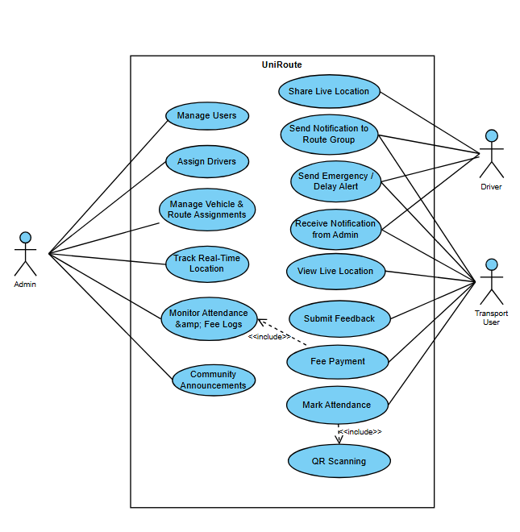
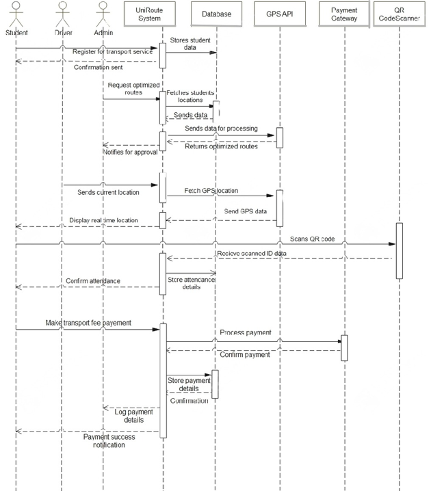
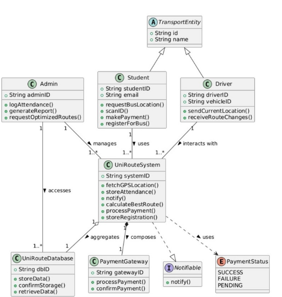

# 🚍 UniRoute: Streamlining Campus Commutes

---

## 🧩 Problem Statement

Managing transportation in educational institutions is often challenging due to a lack of integration, frequent schedule disruptions, and limited communication. Administrators face difficulty tracking vehicles, managing routes, and sending timely updates—leading to delays, inefficiencies, and a poor user experience.

---

## 💡 Proposed Solution

**UniRoute** is a centralized transport management platform that optimizes commute operations through:
- Real-time vehicle tracking
- Intelligent route scheduling
- Seamless coordination between students, staff, and administrators
- Enhanced communication for a smoother transit experience

---

## 🎯 Objectives

- Improve transport efficiency through real-time updates and planning
- Enhance communication among students, faculty, and drivers
- Simplify attendance logging and fee tracking for administrators
- Provide actionable insights for data-driven transport optimization

---

## 🌟 Unique Selling Proposition

UniRoute stands out with:
- ✨ Personalized Admin & User Interfaces
- 🔐 Secure Attendance & Driver Verification
- 📡 Real-Time Vehicle Tracking & Monitoring
- 🔄 Continuous Feedback Loop for Improvements

---

## 🛠️ Technology Stack

### 🔧 Implementation
- **HTML5**, **CSS3**, **JavaScript**
- **Bootstrap**
- **Flask (Python Web Framework)**
- **Firebase** for real-time database and authentication

### 🎨 Design
- **Figma** – For UI/UX prototyping

### 📁 Version Control
- **Git & GitHub**

---

## 🔍 System Architecture & Planning

### • Use Case Diagram

### • Sequence Diagram

### • Class Diagram

---

## 🖥️ Design & Implementation

UniRoute is developed as a **Progressive Web App (PWA)** with:
- A **mobile-first interface** for drivers and students
- A **web-based dashboard** for admins and transport authorities
- Integration with **Firestore** for secure and efficient data handling

---

## 🚀 Deployed Project

🌐 **[Click here to view UniRoute live](https://uniroute-software.onrender.com/)**  

---

## 📈 Future Scope

- 🔍 **AI-Based Route Optimization** – Dynamic schedules based on demand
- 🛡️ **Driver Verification System** – Ensuring authorized personnel operate vehicles
- 🌐 **Scalability** – Expand to larger institutions with high data volumes

---

